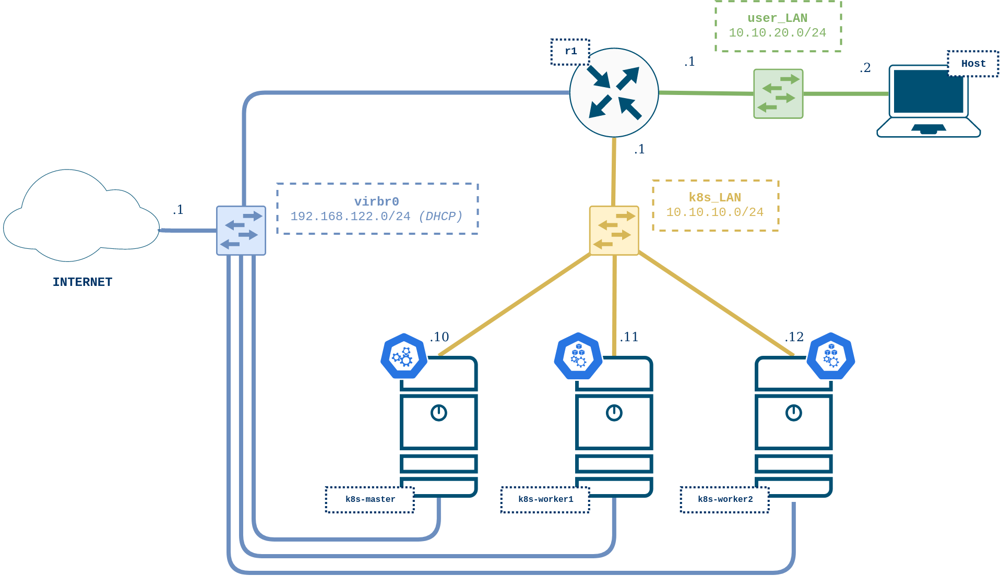

# Clúster de Kubernetes usando Calico

Escenario de VNX que despliega un clúster de Kubernetes de tres nodos, listo para producción, utilizando las utilidades de [Kubespray](https://kubespray.io/#/).


En esta versión del escenario, se utiliza el plugin de red [Flannel CNI](https://github.com/flannel-io/flannel).

## Topología del escenario



Los nodos de Kubernetes se despliegan como máquinas virtuales KVM, mientras que r1 es un contenedores LXC.

## Requisitos

- Sistema Operativo Linux
- Software VNX -> [Guía de Instalación de VNX](https://web.dit.upm.es/vnxwiki/index.php/Vnx-install)
- Conexión a Internet
- Requisitos de hardware: mínimo 8 GB de RAM y 4 núcleos de CPU

Es recomendable ejecutar este escenario en los PCs del laboratorio del DIT.

## Configuración e inicio

Para desplegar el clúster, se debe ejecutar el script `deploy.sh`. Este script automatiza la creación del escenario.

```bash

r.mluengo@l116:~/Documentos/TFM$ ./deploy.sh

```
El despliegue del clúster tarda aproximadamente 20 minutos.

## Interactuando con el clúster

VNX crea un enlace punto a punto para el acceso de gestión y genera dinámicamente un archivo de configuración SSH para el escenario. 
Como resultado, se puede acceder fácilmente a los nodos de Kubernetes y a los demás elementos de la red de la siguiente manera:

```bash

# Nodo master
ssh k8s-master

# Nodos worker
ssh k8s-worker1
ssh k8s-worker2

# Router
ssh r1

```

## Fin del escenario

Para destruir el escenario, se debe ejecutar el script end.sh.

```bash

r.mluengo@l116:~/Documentos/TFM$ ./end.sh

```

## Comandos útiles

El archivo pod.txt incluye comandos útiles para desplegar y gestionar pods en el clúster:

```bash

kubectl apply -f examples/pod1-worker1.yml
kubectl apply -f examples/pod2-worker2.yml
kubectl get pods -o wide
kubectl describe pod pod1-worker1

kubectl exec pod1-worker1 -c busy1-1 -- ifconfig
kubectl exec pod2-worker2 -c busy1-1 -- ifconfig

kubectl exec pod1-worker1 -c busy1-1 -- ip addr
kubectl exec pod2-worker2 -c busy1-1 -- ip addr

kubectl get pods -n kube-system -o wide
kubectl get pods --all-namespaces -o wide

```


